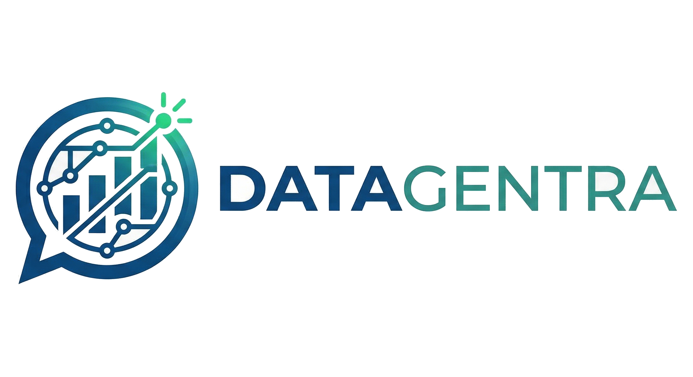
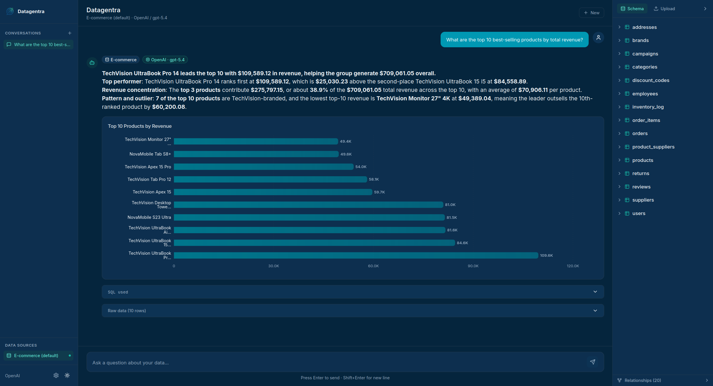
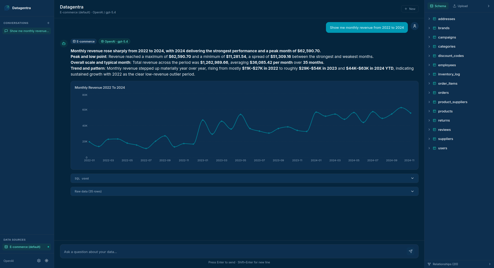
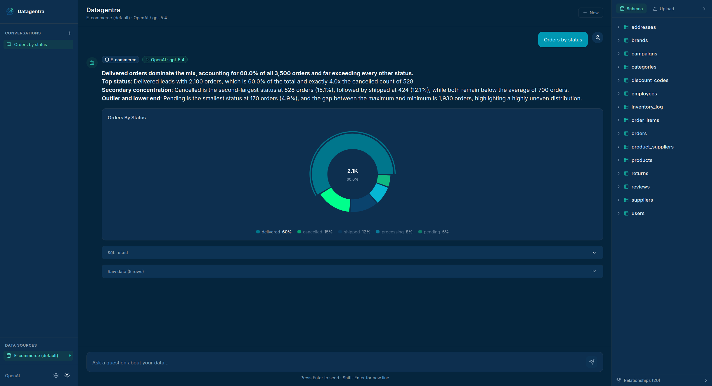
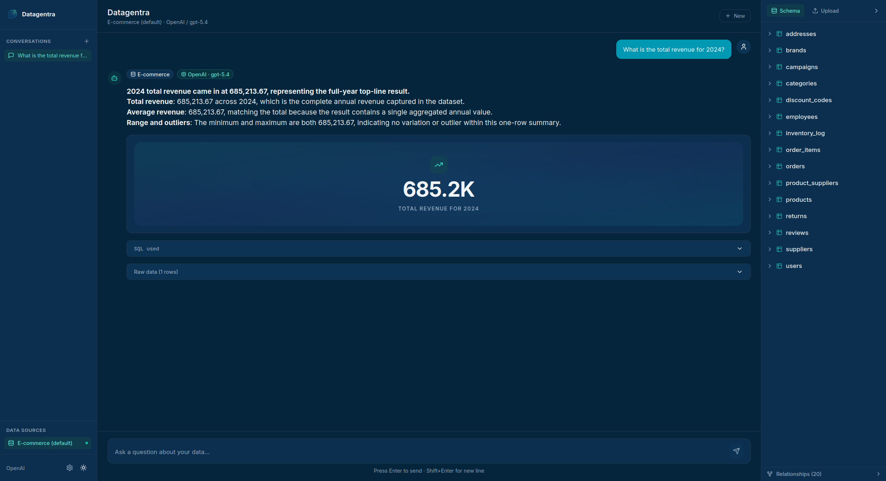
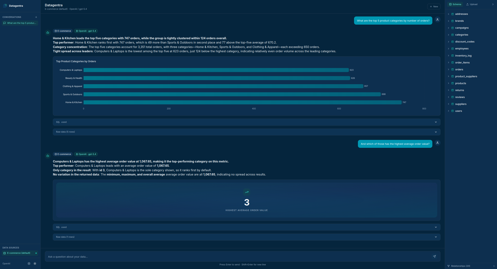
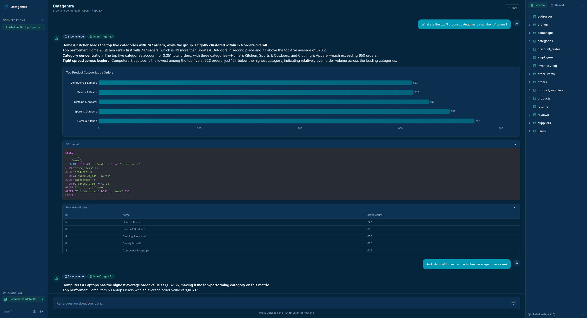

<p align="center">
  
</p>

<p align="center">
  Turn natural language questions into SQL, charts, and insights.<br/>
  100% local with Ollama or cloud-powered with OpenAI. No external database required — everything runs locally with SQLite.
</p>

<p align="center">
  
  
  
  
  
  
</p>

---

## What is Datagentra?

Datagentra is an **autonomous data analyst** that lives on your machine. You ask a question in plain English and it:

1. Reads your question and the active database schema
2. Generates the appropriate SQL query using an LLM
3. Executes the SQL safely (read-only)
4. Analyses the results and writes a summary with key observations
5. Suggests the most suitable chart type and renders it automatically

All in a single chat interface. No SQL writing, no database clients, no CSV exports.

---

## Features

- **Text-to-SQL with retries** — if the SQL fails, the agent analyses the error and regenerates the query automatically (up to 2 retries)
- **Contextual memory per conversation** — the agent remembers the last 6 questions and answers within the same conversation, enabling natural follow-up questions ("and of those, how many are from overseas?")
- **Persistent history** — every conversation is saved in SQLite; create, rename, switch, and delete conversations from the sidebar
- **Automatic charts** — bar, line, area, pie, scatter, data table, or KPI card — chosen automatically based on the query and data shape
- **File upload** — upload a CSV or SQLite file and query it directly with natural language
- **Natural language corrections** — before confirming a CSV, ask things like `"rename column sale_date to date"` or `"drop the internal_id column"` — interpreted by the LLM, so any phrasing works
- **Configurable LLM provider** — OpenAI (cloud, recommended) or Ollama (local, free, no data sent to third parties)
- **Schema Explorer** — side panel with the full structure of the active database: tables, columns, types, PKs, FKs, and relationships
- **Light/dark theme** — with preference saved in `localStorage`
- **Safe execution** — the read-only engine blocks any write operation (`INSERT`, `UPDATE`, `DELETE`, `DROP`, etc.) at both the SQLAlchemy event-hook level and in the agent before execution

---

## Screenshots

**Bar chart** — ranking query rendered automatically as a horizontal bar chart



**Time series** — date-based query rendered as a line/area chart



**Pie chart** — distribution query rendered as a pie chart



**KPI card** — single-metric query rendered as a KPI card



**Contextual memory** — follow-up question referencing the previous result without repeating context



**SQL used** — the exact query the agent generated, visible on demand



---

## How the pipeline works

When you ask a question, the backend runs a 5-step pipeline:

```
User question
      │
      ▼
 ┌──────────────────────────────────────────────────────────┐
 │ 1. SQL Generation                                         │
 │    The LLM receives: DDL schema + conversation history    │
 │    + your question → generates a SQL query               │
 └──────────────────┬───────────────────────────────────────┘
                    │
                    ▼
 ┌──────────────────────────────────────────────────────────┐
 │ 2. Execution with retries                                 │
 │    Runs the SQL on the read-only engine.                  │
 │    On failure, the LLM analyses the error and fixes SQL. │
 │    Maximum 2 automatic retries.                          │
 └──────────────────┬───────────────────────────────────────┘
                    │
                    ▼
 ┌──────────────────────────────────────────────────────────┐
 │ 3. Summary                                                │
 │    The LLM analyses the returned rows and writes a        │
 │    paragraph with the key conclusions and metrics        │
 └──────────────────┬───────────────────────────────────────┘
                    │
                    ▼
 ┌──────────────────────────────────────────────────────────┐
 │ 4. Chart suggestion                                       │
 │    The LLM picks the most suitable chart type            │
 │    (bar / line / area / pie / metric) and axes           │
 └──────────────────┬───────────────────────────────────────┘
                    │
                    ▼
 ┌──────────────────────────────────────────────────────────┐
 │ 5. Final response                                         │
 │    SQL + data + summary + chart → saved to               │
 │    conversations.db → rendered in the chat               │
 └──────────────────────────────────────────────────────────┘
```

---

## Architecture

```
┌─────────────────────────────────────────────────────────────┐
│                        Browser                              │
│   React + Vite + TypeScript + Tailwind + Recharts           │
│   :5173                                                     │
└──────────────────────────┬──────────────────────────────────┘
                           │ HTTP (CORS)
                           ▼
┌─────────────────────────────────────────────────────────────┐
│                    FastAPI Backend :8000                     │
│   ┌────────────┐ ┌─────────────┐ ┌──────────────────────┐   │
│   │  agent.py  │ │data_loader  │ │  conversations.py    │   │
│   │ Text→SQL   │ │CSV / SQLite │ │  History in SQLite   │   │
│   └─────┬──────┘ └─────────────┘ └──────────────────────┘   │
│         │                   llm_provider.py                  │
└─────────┼───────────────────────┬──────────────────────────┘
          │                       │
          ▼                       ▼
┌──────────────────────┐  ┌────────────────────────┐
│ db/datagentra.db     │  │  OpenAI API  /          │
│ E-commerce SQLite    │  │  Ollama :11434 (local)  │
│ db/conversations.db  │  └────────────────────────┘
│ Chat history         │
└──────────────────────┘
```

### Technology stack

| Layer | Technology | Version |
|---|---|---|
| Backend API | FastAPI + Uvicorn | 0.115+ |
| ORM | SQLAlchemy | 2.0+ |
| LLM | LangChain (OpenAI / Ollama) | 0.3+ |
| CSV processing | Pandas | 2.2+ |
| Frontend | React + TypeScript + Vite | 18.3 / 5.6 / 5.4 |
| Styles | Tailwind CSS + Radix UI | 3.4 |
| Charts | Recharts | 2.13 |
| Database | SQLite | — |
| Python package manager | uv | latest |

---

## Prerequisites

You need the following installed before running the setup:

### 1. Python 3.12+

Download from **https://www.python.org/downloads/**

Verify:
```bash
python3 --version   # must show 3.12 or higher
```

### 2. uv (Python package manager)

`uv` is the ultrafast package manager from Astral used by this project. It replaces `pip` + `venv`.

Official docs: **https://docs.astral.sh/uv/**

```bash
# Linux / macOS
curl -LsSf https://astral.sh/uv/install.sh | sh

# Windows (PowerShell)
powershell -ExecutionPolicy ByPass -c "irm https://astral.sh/uv/install.ps1 | iex"
```

Verify:
```bash
uv --version
```

### 3. Node.js 20+ (includes npm)

Download from **https://nodejs.org/en/download** — pick the LTS version (recommended).

`npm` is bundled with Node.js. You can also use **nvm** to manage versions: https://github.com/nvm-sh/nvm

Verify:
```bash
node --version   # must show v20 or higher
npm --version
```

### 4. LLM — pick one:

#### Option A: OpenAI (recommended for best quality)
You need an OpenAI API Key. Create one at: **https://platform.openai.com/api-keys**

#### Option B: Ollama (local, free, no data sent)
Download and install Ollama from: **https://ollama.com/download**

```bash
# Then pull a language model (e.g. qwen2.5:7b — ~4.7 GB)
ollama pull qwen2.5:7b
```

---

## Quick Start (Local)

```bash
git clone <repo-url>
cd Datagentra
chmod +x setup.sh
./setup.sh
```

The `setup.sh` script handles everything automatically:

| Step | What it does |
|---|---|
| 1 | Asks for max upload size and backend URL |
| 2 | Creates `backend/.env` and `frontend/.env` |
| 3 | Creates the SQLite database with sample e-commerce data |
| 4 | Installs frontend dependencies (first run only) |
| 5 | Verifies that `uv` and `npm` are available |
| 6 | Starts the backend (port 8000) and frontend (port 5173) |
| 7 | Waits for both services to be ready and prints the URL |

Once running, open **http://localhost:5173** in your browser.

> Press `Ctrl+C` in the terminal to stop both services.

---

## Docker

> The simplest way to run Datagentra without installing Python or Node.js on your machine.

### Docker requirements

- **Docker Desktop**: https://www.docker.com/products/docker-desktop/
- **Docker Compose** (included in Docker Desktop)

Verify:
```bash
docker --version
docker compose version
```

### Initial setup (first time only)

**1. Create the backend configuration file:**

```bash
cp backend/.env.example backend/.env
```

Open `backend/.env` and fill in your configuration:

```env
# Using OpenAI:
LLM_PROVIDER=openai
OPENAI_API_KEY=sk-your-key-here
OPENAI_MODEL=gpt-4o-mini

# Using local Ollama (see note below):
# LLM_PROVIDER=ollama
# OLLAMA_BASE_URL=http://host.docker.internal:11434
# OLLAMA_MODEL=qwen2.5:7b
```

**2. Create the frontend configuration file:**

```bash
cp frontend/.env.example frontend/.env
```

The file already has the correct value (`VITE_API_URL=http://localhost:8000`) — no changes needed.

### Start with Docker Compose

```bash
docker compose up --build
```

Docker will:
1. Build the backend image (Python 3.12 + dependencies)
2. Build the frontend image (Node 20 + npm install)
3. Run `db-init`: seed the SQLite database if it does not exist
4. Wait for the backend to be healthy (health check at `/health`)
5. Start the frontend once the backend is ready

Once you see the frontend logs, open **http://localhost:5173**.

### Useful commands

```bash
# Start in the background (detached mode)
docker compose up --build -d

# Stream logs in real time
docker compose logs -f

# Logs for a specific service
docker compose logs -f backend
docker compose logs -f frontend

# Stop all services
docker compose down

# Stop and remove volumes (databases included)
docker compose down -v

# Rebuild only the backend
docker compose build backend

# Check container status
docker compose ps
```

### Services and ports

| Service | Container | Port | Description |
|---|---|---|---|
| `db-init` | `datagentra_db_init` | — | Runs once and seeds the database |
| `backend` | `datagentra_backend` | `8000` | FastAPI REST API |
| `frontend` | `datagentra_frontend` | `5173` | React app |

### Ollama with Docker

If you use Ollama installed on your host machine (not in Docker), you need it to listen on all interfaces:

```bash
# Linux (systemd)
sudo systemctl edit ollama
# Add:
# [Service]
# Environment="OLLAMA_HOST=0.0.0.0"

sudo systemctl daemon-reload && sudo systemctl restart ollama
```

Then in `backend/.env` use:
```env
LLM_PROVIDER=ollama
OLLAMA_BASE_URL=http://host.docker.internal:11434
```

> `host.docker.internal` is Docker's special hostname for referring to the host machine from inside a container.

---

## Initial setup (wizard)

When you open the app for the first time in the browser, a wizard guides you through LLM provider configuration:

### OpenAI
1. Select **OpenAI**
2. Enter your API Key (`sk-...`)
3. Click **Validate key & list models** — validates the key against the real OpenAI API and lists the models available in your account
4. Pick a model and save

### Ollama (local)
1. Select **Ollama**
2. The wizard automatically detects models installed at `localhost:11434`
3. Pick a model and save

Once configured, you can change provider or model at any time using the ⚙️ icon in the sidebar.

### Changing settings (SettingsModal)
- Open with the ⚙️ icon (bottom-left of the sidebar)
- When opened, the model list **loads automatically** using the already-saved key — no need to re-enter it
- Leave the API Key field **blank** to keep the current key; fill it in only if you want to change it
- Select the desired model and save

---

## Data sources

### Default database (e-commerce)

On startup, Datagentra uses a SQLite e-commerce database with auto-generated sample data. It includes:
- **15 tables**: products, categories, users, orders, items, payments, shipments, reviews, etc.
- **~500 users**, **~3 500 orders**, **~7 000 items** with temporal variety (2022–2024)
- Designed for complex analytical queries: aggregations, multi-table JOINs, trends

### Uploading your own data source

Click the database icon in the right panel or drag and drop a file:

**CSV** (`.csv`)
- Column types inferred automatically (INT, FLOAT, VARCHAR, DATE, BOOLEAN)
- Shows statistics: null %, min/max, mean, most frequent values
- Preview of the first 10 rows
- You can correct the schema in natural language before confirming:
  - `"rename column sale_date to date"`
  - `"drop the internal_id column"`
  - `"convert the price column to float"`

**SQLite** (`.db`, `.sqlite`)
- Upload your own SQLite database and query it directly

Once the source is confirmed, the agent uses that table/database to answer your questions.

---

## Conversations

Every time you ask a question, the backend automatically saves:
- The user message
- The full agent response (SQL, data, summary, chart configuration)

Everything is persisted in `db/conversations.db` (local SQLite).

**Contextual memory:** within the same conversation the agent remembers the last 6 questions and answers. This enables follow-up questions without repeating context:

```
Q: "What are the top 10 best-selling products?"
A: (table with top 10 + bar chart)

Q: "And of those, how many have a rating above 4?"
A: (the agent understands "those" = the top 10 from before)
```

### UI actions

| Action | How |
|---|---|
| New conversation | `+` button in the sidebar or welcome screen |
| Switch conversation | Click its name in the sidebar |
| Rename | Double-click the name, or the ✏️ icon |
| Delete | 🗑️ icon on hover |
| Auto title | Assigned automatically from the first question |

---

## Environment Variables

### `backend/.env`

| Variable | Description | Default |
|---|---|---|
| `SQLITE_DB_PATH` | Path to the e-commerce database | `../db/datagentra.db` |
| `CONVERSATIONS_DB_PATH` | Path to the conversation history | `../db/conversations.db` |
| `LLM_PROVIDER` | LLM provider (`openai` \| `ollama`) | `openai` |
| `OPENAI_API_KEY` | OpenAI API Key | — |
| `OPENAI_MODEL` | OpenAI model | `gpt-4o-mini` |
| `OLLAMA_BASE_URL` | Ollama server URL | `http://localhost:11434` |
| `OLLAMA_MODEL` | Ollama model | `qwen2.5:7b` |
| `MAX_UPLOAD_SIZE_MB` | Maximum file upload size | `50` |

### `frontend/.env`

| Variable | Description | Default |
|---|---|---|
| `VITE_API_URL` | Backend URL | `http://localhost:8000` |

---

## API Endpoints

| Method | Endpoint | Description |
|---|---|---|
| `GET` | `/health` | Health check (used by Docker and setup) |
| `POST` | `/api/ask` | Full pipeline: question → SQL → data → chart |
| `GET` | `/api/schema` | Schema of the active data source |
| `GET` | `/api/llm-info` | Currently configured provider and model |
| `GET` | `/api/setup/status` | LLM configuration status |
| `POST` | `/api/setup` | Save provider/model/key to `.env` |
| `GET` | `/api/openai/models/current` | List GPT models using the stored key |
| `POST` | `/api/openai/models` | Validate a new API key and list models |
| `GET` | `/api/ollama/models` | List available Ollama models |
| `POST` | `/api/upload` | Upload CSV or SQLite |
| `POST` | `/api/upload/fix` | Apply a natural language correction to the CSV |
| `POST` | `/api/upload/confirm` | Confirm the uploaded source as active |
| `GET` | `/api/conversations` | List conversations |
| `GET` | `/api/conversations/{id}` | Get a conversation with its messages |
| `DELETE` | `/api/conversations/{id}` | Delete a conversation |
| `PATCH` | `/api/conversations/{id}` | Rename a conversation |

---

## Running Tests

```bash
cd backend
UV_PROJECT_ENVIRONMENT=.venv_local uv run pytest tests/ -v
```

> The `.venv` created by Docker has root permissions. Using `UV_PROJECT_ENVIRONMENT=.venv_local` creates a local venv without permission conflicts.

Run only unit tests (excluding integration tests that require real API keys):
```bash
UV_PROJECT_ENVIRONMENT=.venv_local uv run pytest tests/ -v -m "not integration"
```

---

## Project Structure

```
Datagentra/
├── setup.sh                    # Configuration wizard + launcher
├── docker-compose.yml          # Backend + frontend + db-init
├── db/
│   ├── seed_sqlite.py          # Creates datagentra.db with sample data
│   ├── datagentra.db           # E-commerce: 15 tables, ~500 users, ~3 500 orders
│   └── conversations.db        # Conversation history (auto-created)
├── backend/
│   ├── Dockerfile
│   ├── pyproject.toml          # Python dependencies (uv)
│   ├── .env.example            # Configuration template
│   └── app/
│       ├── __init__.py         # Loads .env on startup
│       ├── main.py             # FastAPI endpoints
│       ├── agent.py            # Text-to-SQL pipeline (5 steps)
│       ├── database.py         # SQLite engines + DDL helpers + read-only enforcement
│       ├── conversations.py    # Conversation history CRUD
│       ├── data_loader.py      # CSV/SQLite loader + NLP corrections
│       └── llm_provider.py     # Ollama/OpenAI factory
│   └── tests/                  # Test suite (pytest)
└── frontend/
    ├── Dockerfile
    ├── package.json            # Node dependencies
    ├── .env.example            # Configuration template
    ├── statics/
    │   ├── logo.png            # Logo (transparent background)
    │   └── datagentra.png      # Wordmark logo + text (transparent background)
    └── src/
        ├── App.tsx             # Layout: sidebar + chat + schema. Theme in localStorage
        ├── hooks/
        │   └── useDatagentra.ts    # Central hook: state + API calls
        └── components/
            ├── ChatInterface.tsx       # Chat UI with messages, charts, and SQL
            ├── SchemaExplorer.tsx      # Visual navigation of the active schema
            ├── DataSourcePanel.tsx     # Upload + preview + correction
            ├── SetupWizard.tsx         # LLM configuration wizard
            ├── SettingsModal.tsx       # Post-setup configuration modal
            └── charts/
                ├── DynamicChart.tsx         # Chart router
                ├── BarChartComponent.tsx
                ├── LineChartComponent.tsx
                ├── PieChartComponent.tsx
                └── KPICard.tsx              # Single metric display
```

---

## LLM Modes

### Ollama — local, free, no data sent (recommended for privacy)

All models below run **fully on your machine**. None require an internet connection after the initial download.

```bash
# Install Ollama: https://ollama.com/download

# Pull whichever fits your hardware — sorted from lightest to heaviest
ollama pull lfm2.5-thinking:1.2b   # ~1 GB  — tiny, thinking capable
ollama pull granite4:3b            # ~2 GB  — IBM, lightest with tool support
ollama pull qwen3:8b               # ~5 GB  — best balance (recommended start)
ollama pull qwen3.5:9b             # ~6 GB  — latest Qwen, tools + thinking
ollama pull glm-4.7-flash          # ~19 GB — fast inference, strong reasoning
ollama pull nemotron-cascade-2:30b # ~20 GB — NVIDIA MoE (only 3B active params)
ollama pull qwen3:32b              # ~20 GB — high quality, fully local
```

```env
LLM_PROVIDER=ollama
OLLAMA_BASE_URL=http://localhost:11434
OLLAMA_MODEL=qwen3:8b
```

Models available locally (excludes cloud-only entries):

| Model | Sizes | Capabilities | Notes |
|---|---|---|---|
| `qwen3` | 0.6b · 1.7b · **4b** · **8b** · **14b** · 30b · 32b | tools · thinking | Most popular (25 M+ pulls) — best all-round choice |
| `qwen3.5` | 0.8b · 2b · **4b** · **9b** · 27b · 35b · 122b | tools · thinking | Latest Qwen generation, multimodal |
| `glm-4.7-flash` | 30b class | tools · thinking | Fast, strong at structured output (933 K pulls) |
| `nemotron-cascade-2` | **30b** | tools · thinking | NVIDIA MoE — only 3B params active, excellent reasoning |
| `nemotron-3-nano` | **4b** · 30b | tools · thinking | NVIDIA — efficient, updated recently |
| `lfm2` | **24b** | tools | Liquid AI — designed for on-device deployment (1 M pulls) |
| `lfm2.5-thinking` | **1.2b** | tools · thinking | Minimal footprint, thinking capable (1 M pulls) |
| `granite4` | 350m · 1b · **3b** | tools | IBM — lightest option with tool support (1 M pulls) |
| `qwen3-coder-next` | — | tools | Alibaba — coding and agentic workflows (930 K pulls) |
| `ministral-3` | **3b** · 8b · 14b | tools | Mistral edge model, vision capable |
| `qwen3-next` | **80b** | tools · thinking | High-end quality, strong reasoning |
| `olmo-3.1` | **32b** | tools | Fully open weights — OLMo project |
| `rnj-1` | **8b** | tools | Essential AI — code + STEM focused |

> **Tip:** start with `qwen3:8b` — fits in 8 GB RAM and handles multi-table SQL well. Scale up to `qwen3:14b`, `qwen3.5:9b`, or `nemotron-cascade-2:30b` for more complex analytical queries.

---

### OpenAI (cloud, best quality)

```env
LLM_PROVIDER=openai
OPENAI_API_KEY=sk-...
OPENAI_MODEL=gpt-4o-mini
```

Model ranking for data analysis use cases (source: LLM leaderboard — Data Analysis Average score):

| Model | Data Analysis | Reasoning | Overall | Tier |
|---|---|---|---|---|
| `GPT-5.4 Thinking` | 79.3 | 88.1 | 80.3 | 🥇 Best |
| `GPT-5.2 High` | 78.2 | 83.2 | 74.8 | 🥈 |
| `GPT-5.2 Codex` | 78.2 | 77.7 | 74.3 | 🥈 |
| `GPT-5.1 Codex Max High` | 70.1 | 83.7 | 74.0 | High |
| `GPT-5.4 Mini xHigh` | 71.0 | 72.5 | 67.5 | Balanced |
| `GPT-5 Mini High` | 55.2 | 68.3 | 65.9 | Economy |
| `GPT-5.1 No Thinking` | 44.1 | 26.8 | 42.7 | Fast/cheap |

---

## Visual Identity

<p align="center">
  
</p>

The interface colour theme is based on the logo colours:

| Colour | Hex | Usage |
|---|---|---|
| Deep navy | `#0A436D` | Main text (light theme), card background (dark theme) |
| Vibrant teal | `#00768C` | Primary — buttons, active selections, focus rings |
| Bright green | `#00FF8C` | Accent — active states and highlighted interactions |
| Dark background | `#05243C` | Main background in dark theme |
| Dark card background | `#0D2F4F` | Cards in dark theme |

Theme preference (light/dark) is automatically persisted in `localStorage`.

---

## Troubleshooting

| Problem | Solution |
|---|---|
| `model 'X' not found` | `.env` was not loaded. Restart the backend |
| `Connection refused` for Ollama | Ollama only listens on `127.0.0.1`. See Ollama with Docker section |
| `Permission denied` on `.venv` | Use `UV_PROJECT_ENVIRONMENT=.venv_local uv run ...` |
| `CORS error` in the browser | Verify `VITE_API_URL=http://localhost:8000` is correct |
| Settings modal does not load models | Verify the backend is running and the key is saved in `.env` |
| Docker: `db-init` fails | Check that `./db/seed_sqlite.py` exists and is readable |
| Docker: frontend cannot connect to backend | `VITE_API_URL` must be `http://localhost:8000` (accessed from the host browser) |
| Port 8000 or 5173 in use (local) | `setup.sh` frees them automatically; in Docker run `docker compose down` first |
| CSV with wrong inferred types | Use the natural language correction field before confirming the source |

### View logs locally
```bash
tail -f backend.log   # backend logs
tail -f frontend.log  # frontend logs
```

### Verify the backend is responding
```bash
curl http://localhost:8000/health
# Expected response: {"status":"ok"}
```

---

## License

MIT

---

<p align="center">
  
</p>
